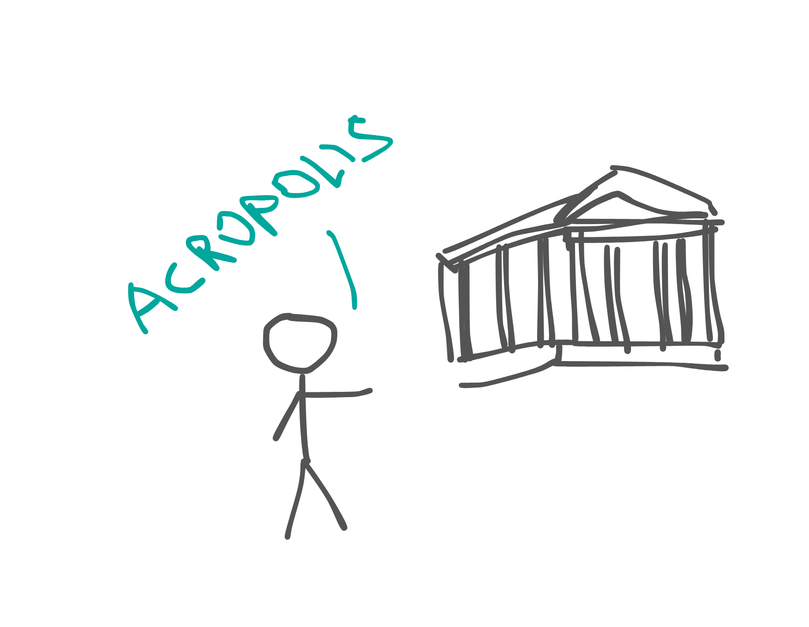
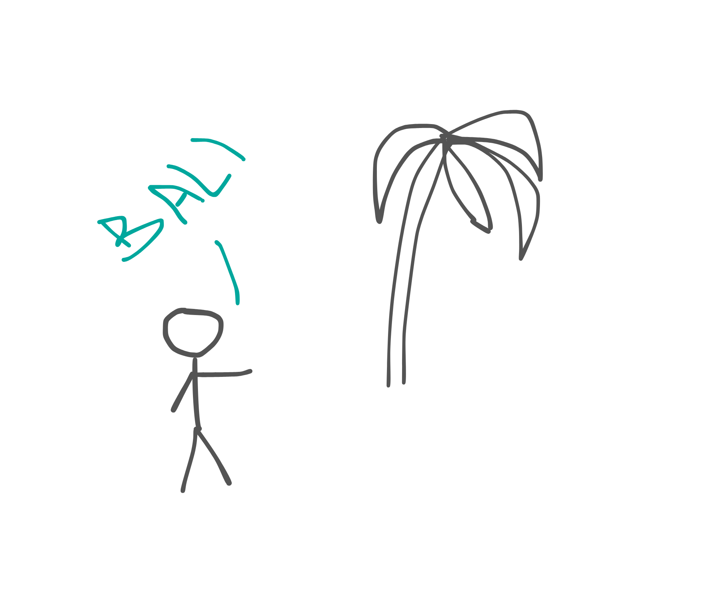

A year and a half of living in Montenegro ended for us in July. We were not the last to leave, but we were not the first either. In March, our annual lease for the villas we lived in was coming to an end. No one was planning to extend the lease for another year, so the conditions would have to change, as the season in Montenegro was about to begin (I wrote about life in this country [here](https://nadtochii.live/en/posts/emigration/)). Many expected this to be a time of great change. In some ways, it did happen. People started leaving Montenegro in different directions, but the main destinations were Poland and Spain. Poland because it is close to Ukraine, both geographically and culturally, and Spain because it is quite easy to get European documents for temporary protection. And this sense of change was in the air. Everyone was asking each other questions: "So, what about you? Are you going or staying?" "We don't know yet. We are thinking. This and that. And you? Are you going?" We kept bargaining with each other to get at least a little information, but not to tell much about our plans. It seemed to me at the time that this was a defense mechanism. No one knew what to do, where to go, whether to settle down or move somewhere else, and by asking each other, they were just looking for options for themselves. We were also on this wave. We were asking questions, trying on clothes, calculating. We were so used to living in a small town by the sea surrounded by mountains that moving to a big city or inland raised a sincere question in our minds: why? Because everyone is going somewhere and we need to? But we still considered a couple of options. One of them was to go to Spain together with my colleagues and friends. We were very good friends, had traveled many thousands of kilometers, got along well in everyday life, and shared a similar worldview. But something stopped us. One of these things was the cost of living in Europe. It seemed to us to be significantly more expensive than in Montenegro, and we didn't really want to reduce our comfort level just for the sake of living in the eurozone. And secondly, we did not choose Spain. We had to go there because our friends wanted us to. They chose it and they knew what they were going there for. We didn't know exactly what we needed it for. From that moment on, we realized that our paths would diverge, whether we went somewhere or not. Because they were going. We asked ourselves, if we don't want to go to Spain, is there a place where we would really want to move? And there was such a place. We had been thinking about it for a long time, since Ukraine. We planned that one day we would go there for a month or so, because it makes no sense to fly so far for a shorter period of time. And now, when we are not under pressure to return, why not fly there? We are talking about Bali now. Everyone has heard of Bali, and every second person would like to visit it. We were one of those people. But we didn't go there that spring. We needed a couple more months of stability. We spent those couple of months/half a year in Montenegro, but we had already begun to mentally detach ourselves from this familiar island of safety.

Meanwhile, the season in Montenegro had arrived. We arranged for accommodation in the same villas, the price went up but was still acceptable, and we enjoyed the summer in the resort town. My friends left, took temporary protection in Spain, and even received a document that, if possible, equated them to full-fledged Spanish citizens, except for the right to vote. But for some reason we were not attracted to this. We continued to enjoy the beaches of the Budva Riviera and the plates of "mixed meat" until an interesting event happened. My wife went to Greece for the weekend to meet her girlfriends. It was not her first trip outside Montenegro, but it was there that she realized that our time in Montenegro was coming to an end. When she was driving back from the airport and passed over Budva, she had a feeling that this stage was over. Shortly after arriving, she came up to me and asked: "So, are we going to Bali?" I didn't need to be persuaded, I had wanted to go there for a long time, and we started looking for tickets.

We only heard a phrase, only a rough draft of the decision, but we already had a feeling that we would soon leave this beautiful country that had sheltered us for a year and a half. From that period on, everything was done with the feeling that we were not here for long. We had to go to the places we liked and hadn't been to in a long time to remember them better, eat in our favorite cafes, maybe for the last time, go to the beaches we like. In short, to enjoy the here and now, to absorb all the beauty and remember everything. Then we realized that we had come here with one suitcase, and in a year and a half we had collected so many things that we couldn't even pack them in two. Packing was not easy. We had to leave a lot behind: things, our usual life, stability, comfort, understanding, and most importantly, the people we had become accustomed to. But instead, we were lured by a new unknown side - Asia. I wanted to go there because it has completely different people, lifestyle, traditions, climate and culture. In Europe, everything is pretty much the same, sometimes worse, sometimes better, but all the same. Asia is completely different. And I wanted to see that.

It was easy to say goodbye to things, but harder to say goodbye to people. We packed only the essentials in our suitcases, and what didn't fit we sold, gave away, or just threw away. One of them turned out to be filled with winter clothes, and that was assuming that we were going to an island where it was always summer. But these suitcases became our home on wheels. We carried everything we had so far. We didn't know how long we were going to Bali for, whether Asia would suit us, how soon and where we would return afterwards, so we decided to be prepared for any climate conditions and carry all our things with us. We bought our tickets at the very end of the summer. But we had to leave Montenegro a little earlier.

Due to certain circumstances, we had to leave our apartment a month early. Finding accommodation in Montenegro in the middle of summer for a month, not for all the money in the world, is a challenge with an asterisk. Our tickets to Bali were from Athens. Even with the new tickets (I bought the previous ones without the ability to postpone the departure date), accommodation could be found there much cheaper. Another advantage was the opportunity to live in another country. That's how we ended up in Greece. So, Athens. The ancient capital of Greece, a city with thousands of years of history, the cradle of ancient philosophers and scientists. Did I expect anything from them? Not really. I perceived this destination only as a transit station to Asia. I flew here without preconceptions and expectations, and left with mixed impressions and emotions. The flight from Podgorica took a little over 2 hours. By the time we were seated and lunch was served, it was time to leave. Greece greeted us with a nice airport and a convenient subway interchange right from it. We rented an apartment just within walking distance of the metro, so the choice of transportation was obvious. The blue line of the Athens metro is nice. With new cars, new stations, and nice people in the cabin, but we had to change to the green line. And it was not just a transition from one line to another, it was a transition to another world. The stations immediately became shabby, dirty, and among the passengers on the platform you could see a fairly large number of various kinds of marginalized people. And the trains. When I saw the train from this branch, for some reason I imagined the New York subway of the 80s, although I had never been there. All the cars on our train were completely covered with graffiti. Both inside and outside. It was not some kind of author's thoughtful project, it was vandalism. Looking ahead, all the trains of our branch and not only trains were like that. In this new world, we had to travel through a dozen stations, and the feeling inside this subway changed from friendly and curious to cautiously tense. And then there's the contingent. It also changed. Some young men came into our carriage and discussed something quite loudly with each other, and one of them then began counting cash out of his pocket in front of everyone. At one of the stations, they met some of their friends, who were smoking cigarettes on the platform and gave a couple of puffs to those in the car. They were not smoking tobacco. We moved to another part of the car, because the locals did the same. Then we spent another 20 minutes with two suitcases and two backpacks walking along a not very well-suited road to the apartment and, having checked in, sat down and exhaled. The first impressions were not very welcoming. My arm injury, which was bothering me at the time, added to the tension. The new place did not seem safe, and I was not able to fully defend myself and my wife. The next day, we decided that first impressions can be deceiving and that the combination of negative factors simply spoiled our acquaintance with the city, so we decided to go for a walk around the area in the evening and see it with an unbiased eye. But the more we walked, the more we found confirmation of our first impressions. The streets were dirty, the ground floors of virtually all the buildings were painted over, we saw homeless people or drug addicts on the streets every now and then, and small mopeds were running through one of the gutters that stretched across the neighborhood. We returned to the apartment and exhaled again. From then on, I treated Athens as just a place to stay before we left. Of course, it has a lot of interesting and beautiful things. It's the cradle of antiquity, where world-famous people lived, where ancient philosophies were born (my favorite Stoicism comes from Athens), where every stone is remarkable, where everything is imbued with history and authenticity. But also something else. The crowds of tourists in the center and the homeless, drug addicts, migrants a little further from the tourist spots. This could be the judgment of a person who came from a small tourist town to a big city with his own deformed view of things, but even the locals confirmed it - life in Athens has become uncomfortable and more affluent people prefer to buy real estate outside the capital and live there. I tried to find something good in Athens and Greece in general, but in my memory this city will remain just that - noisy, dirty, and covered with graffiti. Still, I'm grateful for its shelter. I have no right to judge a foreign country and its people, and here I have described only my emotions and feelings. Once again, I thank this city and the people I met there and with whom I communicated. It was time for us to move on.

The flight to Bali was our first transcontinental flight. We had never flown so far before. Although we chose the fastest and most affordable route, it took about 15 hours to complete and included one stopover in Singapore. The main flight from Athens to Singapore took 11 hours, with a layover of 1.5 hours and another 2.5-3 hours from Singapore to Denpasar. This is the optimal route because the two flights were operated by the same company and we did not have to pick up and re-check our luggage. Therefore, the transfer in Sipgapur was planned for only 1.5 hours, and in the end there was only one. I was a little bit sorry about that, because Singapore airport is considered the most beautiful in the world and there is a lot to see there. But the 1-hour layover was quite comfortable. We got off one plane, went to another gate, went through customs, and boarded the same plane and almost the same seats, which made it seem like we just got off the bus at a gas station to stretch our legs. The 2.5-hour flight after the 11th seemed like a simple trip to the seaside in Athens. I had just finished a draft of the article and we were met at Denpasar airport. Immediately after getting off the plane, I could feel the tropical climate of these latitudes-warm and humid. We breathed in and out and went to passport control. There was a lot to exhale. This is probably the only passport control where almost everyone who approached the controllers with a passport and a bunch of other documents was nervous, and the checking process included not only a stamp in the passport, but also visas, return tickets, fingerprints, a photo and a bunch of additional questions, such as the purpose of the visit, where you will live and when you plan to leave the island. The checkpoint to the paradise reliably checks everyone who wants to get there. But then we hear "welcome to the Bali" and exhale again, this time with relief. Then there were fairly simple technical steps: pick up the luggage, go through customs, get some local currency and the Internet. We managed to do this quickly and left the airport a little tired, but with a sense of accomplishment. Immediately at the exit, we were greeted by the typical tropical greenery that we missed so much in sun-baked Athens and a bunch of taxi drivers who persistently offered us transportation services. This was the beginning of a new stage in our lives.

I was planning to describe my first impressions of Bali in this article, but it was already too long, so I decided to break it up and release the second part soon. So here goes.
