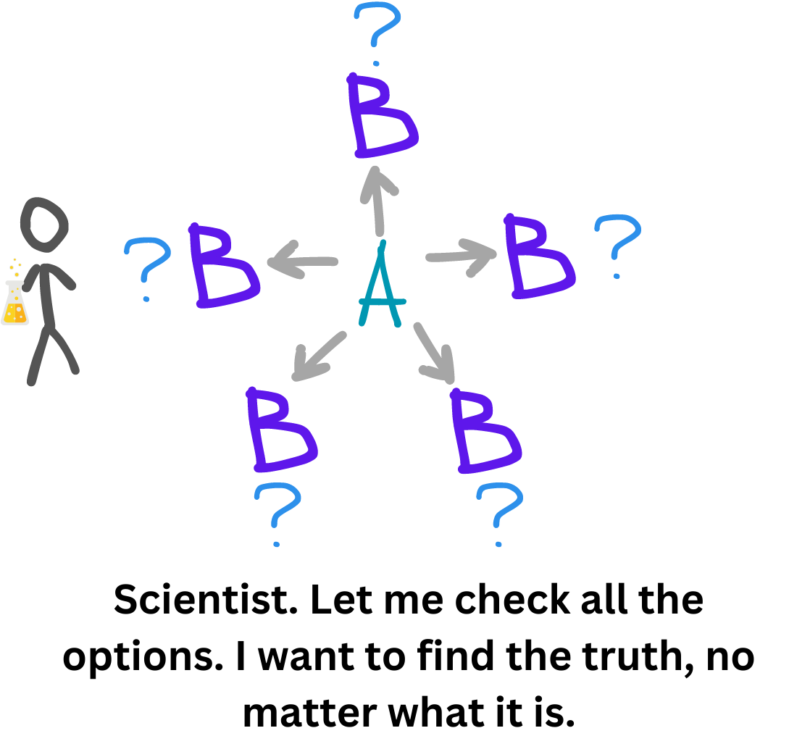
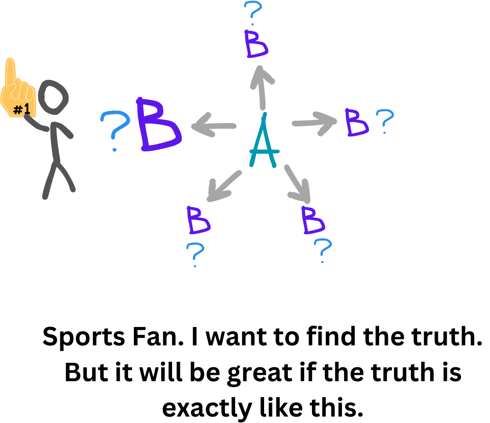
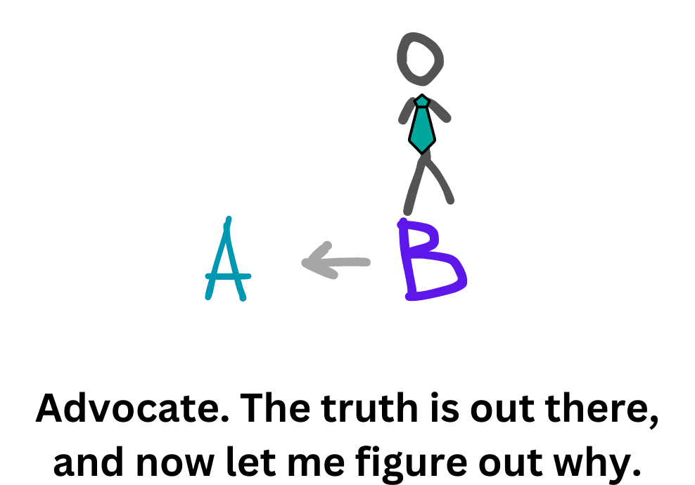
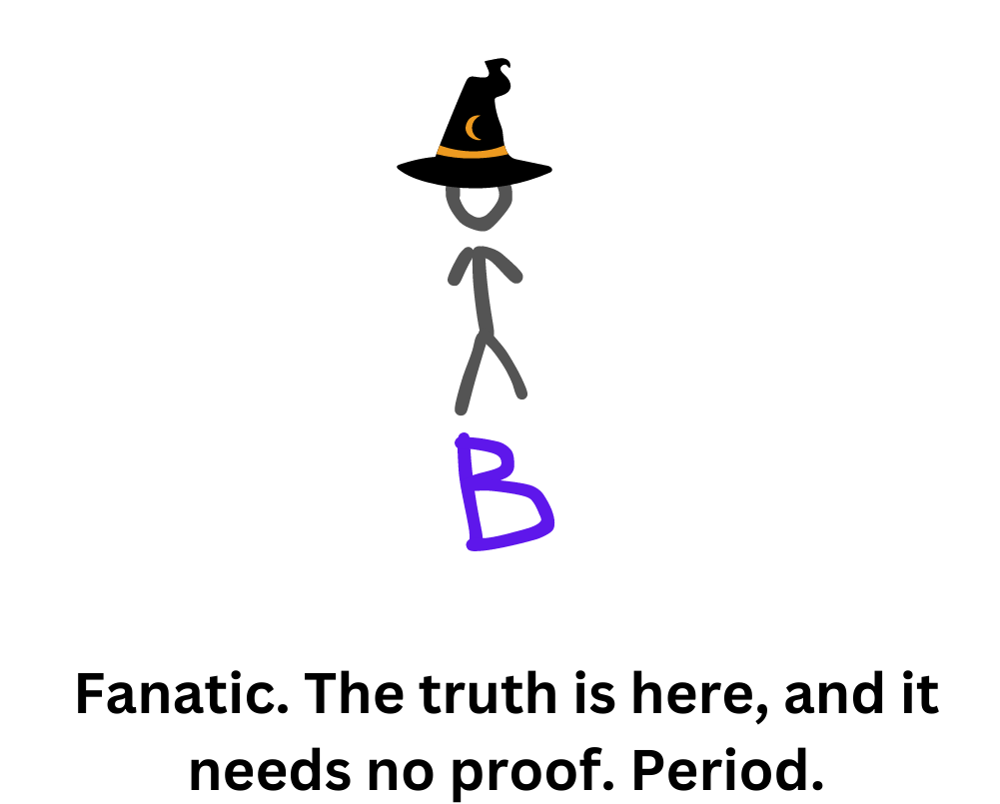

You usually think with your head. Even in those moments when you are asked: "What were you thinking about before you did that?" Most likely, then you also think with your head, but I suspect that it's not the right part. Our brains have been developing for thousands of years, learning new things, but not abandoning the old. Over thousands of years, it has become very smart, but the habits of primitive people have not disappeared. They fade into the background to intervene in those moments when there is a threat to life or existence. I will call it the Primitive Mind, and the one that humanity has acquired over the past thousands of years is the Higher Mind. Most of the time, you are guided by the Higher Mind. It allows us to think logically, in a structured way, and make informed decisions. But sometimes the Primitive Mind also manifests itself. It's used to great effect by marketers at supermarket checkouts, slipping all sorts of sweets under your nose while you wait in line. The primitive mind still remembers how you could sit in a cave for weeks without food, so you need to get the maximum amount of calories for future use. Who knows, you might have to go hungry again. That's why you often buy all sorts of sweet treats, eat half of a chocolate bar at a time instead of just 1 piece, and choose a croissant over an apple for breakfast. For the Primitive Mind, this is quite adequate behavior, and moreover, it is its task. But the period of fasting never comes, and you continue to eat. This is just one example, but you get the point.It is responsible for preserving you as a race and thinking in cave terms. He still has fresh memories of mammoths, hungry weeks and cold months. His job is to survive and reproduce. When it feels threatened or an opportunity for these things, it tries to take over your head. And what about the Higher Mind? It is responsible for thinking, reflection, structure, logic, rationality. It was the development of the neocortex that helped humans become the dominant race on Earth. Its role goes far beyond basic human needs, and it asks the question "Who am I and what is the meaning of my life?”

You've probably heard this concept before. I'm just reminding you of it because I'll be referring to it a bit further. Now, let's imagine four possible situations of the coexistence of these two entities and their dominance in a pair. In the first case, the Higher fully controls the Primitive, in the second it still dominates, but the Primitive is already making itself felt, in the third the Primitive dominates, but the Higher is still slightly audible, and in the fourth, the Primitive is in full control. These four situations are what we are going to look at now.

### Think like a scientist

A scientist doesn't care what the final result of an experiment is, as long as it is true. He does not set expectations for the experiment, does not falsify the results, he does everything as honestly and without bias as possible. What he gets in the result is what he accepts. The research process itself consists of two main stages: hypothesis formation and testing. At the formation stage, information is first collected. Here it is important to find as many different sources about the research object as possible without sorting through and rejecting any versions. The more, the better. Controversial? That's fine. Different in meaning? Pack two more. Then comes the verification process. And if the collection was about quantity, the verification is about quality. Each source is checked for veracity, the data is verified, and a cross-check is made. This is where so-called indirect knowledge plays a big role. This simple concept made a big opening in my head. Just imagine, most of the knowledge (I would say 90%) you know is because someone told you about it and you believed it. This applies not only to news, advertising, and election promises. At school, you were told that 2+2 = 4, and you believe it. And then you will tell your children that it is still 4. The fact that the Earth is the third planet in our system from the Sun was seen with the eyes of a small group of people, but everyone on the planet knows about it. If you go deeper into thinking about this concept, you will find yourself in a matrix where everything is built on conventional agreements between people, that everyone will believe the same thing. That this piece of paper is a banknote and you can get any real things for it, that this yellow metal with not the most outstanding physical characteristics is precious and worth a lot of banknotes. And our entire space is filled with such statements. It is this concept that has created great progress in the development of mankind with the emergence of convenient ways to transmit indirect knowledge to future generations. There is a very important cog in this system: trust in the source. When a friend tells you about a very profitable investment in cryptocurrency, you have to trust him and his expertise in this area. Moreover, you have to trust his sense of trust in the indirect knowledge he has gained before and the sufficient level of his critical thinking. And you also have to take into account the fact that each person has their own prism of knowledge and experience. All information goes through this prism and is somewhat distorted relative to the source. Sometimes we add our own judgments, sometimes we add assessments, change the priority, focus, and miss details. In short, it's a game about a broken phone. If you didn't hear it, you made it up. Therefore, the main tool of a scientist at this stage is healthy skepticism and critical thinking. Indirect knowledge is good, but believing everything is very dangerous for the purity of the experiment. From these puzzles of information, a scientist forms hypotheses. He forms different and many. He tries to put together even seemingly incompatible things. Then comes the stage of testing. After all, a hypothesis can be perfect only on paper, but a scientist needs to prove that it is effective in practice. Therefore, he takes them one by one, tests them, reflects, corrects, and goes back and forth until he finds the true version. The scientist is not attached to his or her hypotheses, and does not favor any of them, so he or she can accept and reject any option. He also clearly separates hypothesis and personality. If another scientist says to him: "Your theory is worthless, and here's why!", he will say something like, "Good point, I've never looked at it from that perspective" and will not take it as an offense to the personality, but as another chance to improve his hypothesis and get even closer to the truth. That is why a scientist often doubts his or her ideas and re-examines them from time to time.

### Think like a sports fan

A sports fan really wants the judges on the field, the referee in the ring, or the jury in the audience to be objective and fair. He hopes for a clean game according to the rules and a fair result. At the same time, he also wants his team or athlete to win under these conditions. He is capable of downplaying the failures of his favorites and boasting about at the very least some successful results as if they were the most important achievement of all time. He still wants to find the truth, but it would be super cool if the truth was the way he wants it to be. Because of this, he is not always objective and often leans in one direction. Like a scientist, a fan still collects information, but he or she may consciously or unconsciously miss some information that is not suitable. They still analyze and form hypotheses, but they do so through their own filter. At the testing stage, he is tied to his hypotheses and expects the result to be based on them. He is very much like a scientist and wants to find the truth, but he is a bit corrupted by his ideas. That's why a fan is a little more confident in their ideas than a scientist and boldly declares them.

### Think like an attorney

An attorney is very similar to a sports fan in his or her attachment to an idea. But if a fan is pressed with facts and evidence, he will still accept the truth, no matter how bitter it may be for him. An attorney, on the other hand, will defend his position to the end. He doesn't go from point A to point B. He starts from point B and then looks for proof of how he got there. I have a statement B, and I will prove it to you now. Otherwise, would a real attorney be a good professional in his field if he did not do this? He collects only the information necessary to confirm it, and ruthlessly rejects or ignores the rest. He tests hypotheses only with favorable conditions for him. If there are no such conditions, to hell with tests, take my word for it, because I believe it to be true. Arguing with a lawyer is like arguing with a wall. You can't change his mind, and you can easily become his personal enemy because his ideas are very much attached to his identity. If an attorney believes in UFOs, he will give you hundreds of examples of their existence to prove it to you, and without a proper amount of skepticism and critical thinking, you may believe it yourself, as his confidence in his rightness will be undeniable. That is why lawyers often get stuck in their beliefs, do not develop and do not learn anything new.

### Think like a fanatic

A fanatic doesn't go from point A to point B. Like an attorney, he is already at point B. But he doesn't need to prove anything. He is 100% sure that he is right, and if someone agrees with him, he perceives it as an obvious fact, and if someone opposes him, then this person does not understand anything and you should not deal with him. His ideas are very fragile and unreliable, and he is so attached to them that he is the idea himself. That's why any meaningful or meaningless criticism is a personal attack on him, and he perceives it accordingly. There is no gathering of information or testing of theories here; there is a fact. It is exactly that. Period. The world of a scientist is quite complex. It is full of doubts, checks, and open questions. Life is foggy and not clear. The life of a fanatic is clear, simple and understandable. But it is black and white. There is my truth and there is the rest. A fanatic is not interested in how true his statements are. He is 100% sure of them.

The first two ways of thinking are productive ways. With their help, you grow, learn something new, and are open to knowledge. It is through them that you gain knowledge and wisdom. The latter two are one-sided. You are attached to your ideas, biased by the outcome, and almost never change your mind, which leads to a loss of plasticity in your mind and the creation of false beliefs. So try to spend more time in the first two roles.

And finally. You remember the concept of indirect knowledge, right? This is an example of it. These ideas are not mine, I just read them in the book "What's our problem?" by Tim Urban and retold them to you, of course, putting them through my prism. Therefore, you need to take this text with a bit of skepticism and critical thinking. I would trust the author of this book, he wrote it for 6 long years and very deeply dug into this topic. But maybe it's the sports fan in me that's speaking right now, because I like the author's ideas and want them to be right. After reading this article, I had a desire to do more "scientific work". To set a task or goal and deal with it like a scientist, to create my own conclusions and get a live result, not just to tell you something I learned yesterday myself.
