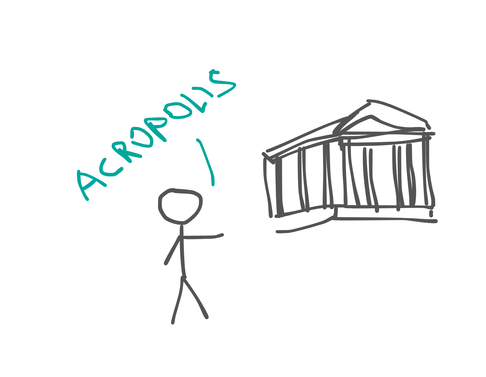
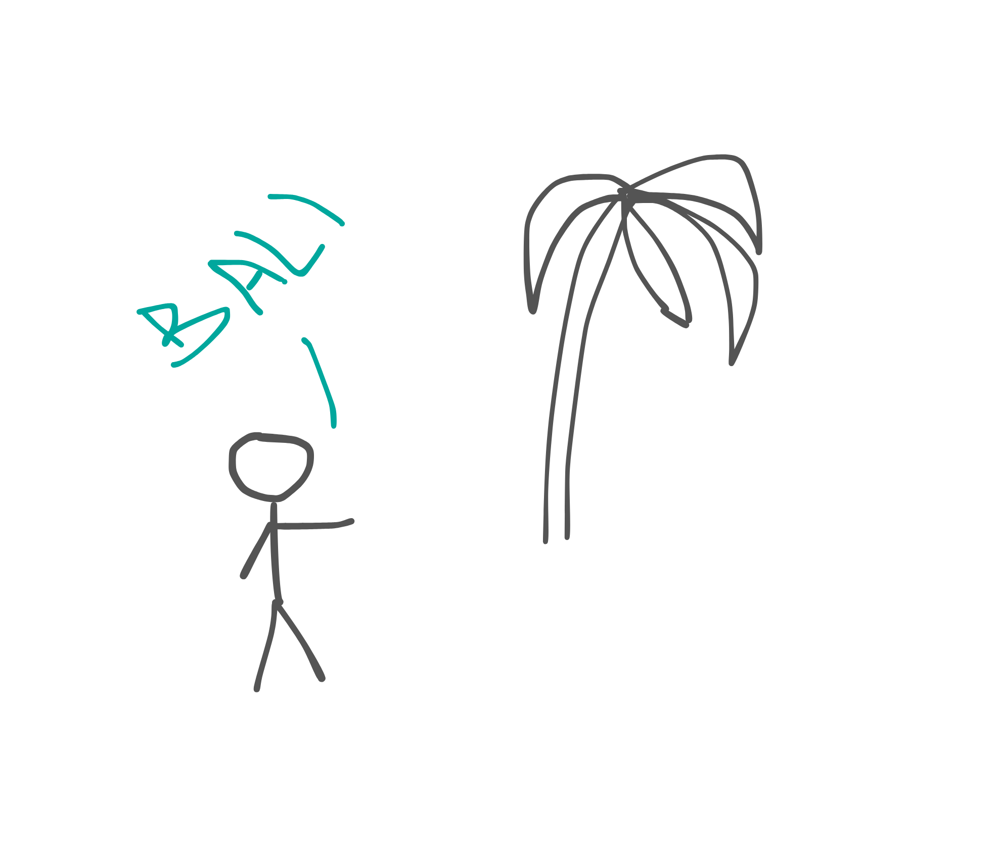

Півторарічний етап життя в Чорногорії завершився для нас в липні. Ми не останні, хто поїхав звідти, але й далеко не перші. В березні добігала кінця наша річна оренда вілл, в яких ми жили. Продовжувати ще на рік оренду ніхто не планував, а отже умови мали б змінитись, оскільки скоро починався сезон в Чорногорії (про життя в цій країні я писав от [тут](https://nadtochii.live/uk/posts/emigration/)). Багато хто очікував цього, як часу великих змін. Десь так і сталось. Люди почали розʼїжджатись з Чорногорії в різні сторони, але основними напрямками були Польща та Іспанія. Польща, бо близько до України, як територіально, так і культурно, Іспанія, бо доволі просто отримати європейські документи для тимчасового захисту. І це передчуття змін повисло в повітрі. Всі розпитували один одного: “Так а ви що? Їдете куди чи залишаєтесь?” “Ще не знаємо. Думаємо. Те се. А ви? Їдете?” Так і торгувались один з одним, щоб випитати хоч крихту інформації, але й про свої плани багато не розказувати. Мені здавалось тоді, що це спрацьовував захисний механізм. Ніхто не знав, що робити, куди їхати, осідати десь уже чи знову кудись переміщатись, і розпитуючи один одного, просто шукали варіанти для себе. Ми також були на цій хвилі. Розпитували, примірялись, прораховували. Ми настільки звикли до життя в маленькому містечку на березі моря в оточенні гір, що переїзд кудись у велике місто чи вглиб материка викликав у нас щире питання, а для чого? Бо всі кудись їдуть і нам треба? Але пару варіантів ми все ж розглядали. Один із них, поїхати разом з моїми колегами та друзями разом в Іспанію. Ми з ними дуже добре товаришували, проїхали не одну тисячу кілометрів, гарно ладили в побуті та підходили по світобаченню. Але нас дещо зупиняло. Одним з цих дещо було вартість життя в Європі. Воно нам здавалось відчутно дорожчим, ніж в Чорногорії, а знижувати рівень комфорту просто заради життя в єврозоні не дуже хотілось. І друге, ми не вибирали Іспанію. Ми мали б туди їхати, бо так хотіли наші друзі. Вони її вибрали й вони знали за чим вони туди їдуть. Ми ж не знали достеменно, для чого вона нам. З того моменту ми зрозуміли, що наші шляхи розійдуться, поїдемо ми кудись чи ні. Бо їдуть вони. Ми задали собі питання, якщо в Іспанію ми не хочемо, то чи є місце, куди ми дійсно прагнули б переміститись? І таке місце було. Ми про нього думали давно, ще з України. Планували, що одного разу поїдемо туди десь на місяць, бо на коротший термін так далеко летіти нема ніякого сенсу. І от зараз, коли на нас не тисне час повернення, чому б не полетіти туди? Мова зараз йде про Балі. Кожен чув про Балі, кожен другий хотів би там побувати. Ми були саме з таких. Але тією весною ми туди не поїхали. Нам треба було ще пару місяців стабільності. Ці пару місяців/пів року ми провели ще в Чорногорії, але вже почали ментально відвʼязуватись від такого вже звичного острівця безпеки для нас.

Тим часом в Чорногорії наступив сезон. Ми домовились про житло на тих же віллах, ціна виросла, але все ще була прийнятною і насолоджувались літом в курортному містечку. Друзі поїхали, стали на тимчасовий захист в Іспанії, отримали навіть документ, що по можливостях прирівнював їх до повноцінних громадян Іспанії, крім прав голосувати. Але нас це чомусь не манило. Ми продовжували насолоджуватись пляжами будванської рівʼєри та тарілками “мешеного меса”, аж допоки не сталась одна цікава подія. Моя дружина поїхала на вихідні в Грецію зустрітись зі своїми подружками. Це не перший виїзд за межі Чорногорії, але саме там до неї прийшла думка, що наш час життя в Чорногорії добігає кінця. Коли вона поверталась з аеропорту і проїжджала над Будвою, в неї виникло відчуття завершення цього етапу. Невдовзі по приїзду, вона підійшла до мене і спитала: “Так що, їдемо на Балі?” Мене вмовляти не треба було, я там побувати хотів давно і ми почали придивлятись квитки.

Прозвучала лише фраза, тільки чорновий варіант рішення, але вже виникло відчуття, що скоро ми все ж залишимо цю прекрасну країну, яка прихистила нас на півтора року. З цього періоду всі справи робились з відчуттям, що ми тут вже не на довго. Треба було зʼїздити в місця, які нам подобались і де давно не були, щоб краще запамʼятати їх, поїсти в улюблених кафешка, можливо, останній раз, сходити на пляжі, які нам подобаються. Словом, насолоджуватись тут і зараз, вбирати всю красу і запамʼятати все. Потім прийшло розуміння, що приїхали ми сюди з однією валізою речей, а за півтора року назбирали їх стільки, що не впакуємо їх уже навіть у дві. Збори були не простими. Багато чого треба було лишити: речі, звичне життя, стабільність, комфорт, розуміння, а головне — людей, до яких ти вже звик. Але натомість нас заманювала нова незвідана сторона — Азія. Я хотів туди, бо це зовсім інші люди, стиль життя, традиції, клімат і культура. В Європі все доволі однакове, десь гірше, десь краще, але все таке ж. Азія ж зовсім інша. І на це хотілось глянути.

З речами прощатись було просто, з людьми — складніше. У валізи ми пакували лише необхідне, що ж не поміщалось — продавали, роздавали або ж просто викидали. Одна з них виявилась наповненою зимовими речами, це при умові, що ми їдемо на острів, де завжди літо. Але ці валізи стали для нас домом на колесах. В них ми возили все, що наразі маємо. Ми не знали, на скільки летимо на Балі, чи підійде нам Азія, як скоро і куди ми повернемось після, тому вирішили бути готовими до будь-яких кліматичних умов і возити всі речі з собою. Квитки ми купили на самий кінець літа. Але поїхати з Чорногорії нам довелось трохи раніше.

Через певні обставини, нам треба було виїхати на місяць раніше з наших апартаментів. Знайти житло в Чорногорії в середині літа на місяць не за всі гроші світу — задача з зірочкою. Наші квитки на Балі були з Афін. Навіть з урахуванням нових квитків (попередні купував без можливості перенести дати вильоту), житло там можна було знайти значно дешевше. Плюсом була можливість пожити ще в одній країні. Так ми опинились в Елладі. Отже, Афіни. Древня столиця Греції, місто з багатотисячною історією, колиска древніх філософів і науковців. Чи очікував я від них щось? Не дуже. Я сприймав цей пункт призначення тільки як перехідну станцію в Азію. Прилітав сюди без упереджень та завчасних очікувань, а вилітав з неоднозначними враженнями та емоціями. Переліт з Подгориці займав трохи більше 2-ох годин. Поки всілись, поки винесли всім обід, вже й виходити пора. Греція зустріла нас приємним аеропортом і зручною транспортною розвʼязкою у вигляді метро одразу з нього. Квартиру ми винайняли якраз в пішій доступності від метро, тому вибір транспорту був очевидний. Синя гілка афінського метро приємна. З новими вагонами, новими станціями та гарними людьми в салоні, але нам треба було пересідати на зелену. І це був перехід не просто з гілки на гілку, це був перехід в інший світ. Станції враз стали пошарпані, брудні, а серед пасажирів на пероні можна було побачити доволі велику кількість різного роду маргіналів. І поїзди. Коли я побачив поїзд з цієї гілки, чомусь уявив метро Нью-Йорка 80-х, хоча ніколи там не був. Всі вагони нашого поїзда були повністю покриті графіті. Як зсередини, так і ззовні. Це не були якісь авторські продумані проєкти, це був вандалізм. Забігаючи наперед, такими були всі поїзди нашої гілки та й не тільки поїзди. В цьому новому світі нам треба було проїхати з десяток станцій і відчуття всередині цього метро змінились з дружньо-допитливого на обережно-напружене. Плюс контингент. Він також змінився. В наш вагон зайшли якісь молодики і щось доволі гучно між собою обговорювали, один з них потім почав на виду у всіх перераховувати готівку з кишені. На одній із станцій вони зустріли якихось своїх знайомих, ті на пероні курили цигарки і дали пару затяжок зробити тим, хто був у вагоні. Курили вони не тютюн. Ми перемістились в іншу частину вагона, бо й місцеві зробили так само. Потім ще хвилин 20 з двома валізами та двома рюкзаками ми добирались по не дуже пристосованій дорозі до апартаментів і, заселившись в них, сіли й видихнули. Перші враження були не дуже привітні. Напруги додавала ще моя травма руки, яка на той час мене турбувала. Нове місце не здавалось безпечним, а я повноцінно й постояти за себе та дружину не в змозі. На наступний день ми вирішили, що перші враження можуть бути оманливими й збіг негативних факторів просто зіпсував знайомство з містом, тому ми вирішили ввечері вийти прогулятись районом і подивитись на це неупередженим поглядом. Але чим більше ми гуляли, тим більше знаходили підтверджень нашим першим враженням. Брудні вулиці, обмальовані перші поверхи фактично всіх будівель, на вулицях раз по разу зустрічались чи то бомжі, чи наркомани, по дорозі носились малолітражні мопеди через один з прямотоками, які дирчать на ввесь район. Ми повернулись в апартаменти й знову видихнули. З того часу я ставився до Афін просто як до місця, де треба побути до нашого відльоту. Безперечно, в ньому є багато цікавого і красивого. Це колиска античності, тут жили відомі всьому світу люди, започатковувались стародавні філософії (мій улюблений стоїцизм родом з Афін), кожен камінь визначний, тут все пронизано історією та автентичністю. Але також дечим ще. Юрбою туристів в центрі та бездомними, наркоманами, мігрантами трохи далі від туристичних місць. Це могли би бути судження людини, яка приїхала з маленького туристичного містечка у великий поліс зі своїм деформованим поглядом на речі, але це підтверджували навіть місцеві — життя в Афінах стало не комфортним і більш забезпечені люди воліють купувати нерухомість за межами столиці та проживати там. Я намагався знайти щось хороше в Афінах і Греції загалом, але в моїй памʼяті це місто залишиться саме таким — шумним, брудним і обписаним графіті. Та все ж, дякую йому за прихисток. Я не маю права судити чужу країну і людей в ній, тут я описав лише свої емоції та відчуття. Ще раз, дякую за все цьому місту і людям, яких я там зустрічав і з якими я комунікував. Нам пора було рухатись далі.

Переліт на Балі був для нас першим трансконтинентальним. Ніколи до цього ми не літали так далеко. Хоча ми й вибрали найшвидший і оптимальний за ціною маршрут, він цілком займав приблизно 15 годин перельоту і включав одну пересадку в Сінгапурі. Основний переліт Афіни — Сінгапур займав 11 годин, на пересадку там відводилось 1.5 години та ще приблизно 2.5-3 години з Сінгапура до Денпасара. Це оптимальний маршрут, оскільки два рейси виконувались однією компанією і нам не треба було забирати й перереєстровувати багаж. Тому пересадка в Сіпгапурі планувалась всього на 1.5 години, а в результаті взагалі виявилась тільки одна. Про що я дещо навіть шкодував, оскільки сінгапурський аеропорт вважається найкрасивішим у світі й там є на що подивитись. Але пересадка в 1 годину була досить комфортна. Ми вийшли з одного літака, перейшли на інший ґейт, пройшли митний контроль і сіли в такий же літак і майже на ті ж самі місця, що додавало вражень, ніби ми просто вийшли з автобуса на заправці ноги розімʼяти. 2.5-ий переліт після 11-ого здався нам як проста поїздка на море в Афінах. Я якраз дописав чернетку статті й нас зустрічав аеропорт Денпасара. Одразу по виходу з літака відчувся тропічний клімат цих широт — тепло і волого. Ми вдихнули-видихнули його і пішли проходити паспортний контроль. Видихати було перед чим. Це чи не єдиний паспортний контроль, на якому було помітно нервування майже в кожного, хто підходив з паспортом і купою інших документів до контролерів, а сам процес перевірки містив не тільки відмітку в паспорті, але й візи, зворотні квитки, зняття відбитків пальців, фотографія і купу додаткових питань, на кшталт, мета візиту, де будете жити та коли плануєте покинути острів. Перепускний пункт в райське місце надійно перевіряє всіх охочих туди потрапити. Але тут ми чуємо “welcome to the Bali” і видихаємо ще раз, тепер уже з полегшенням. Далі були доволі прості технічні кроки: забрати багаж, пройти митний контроль, роздобути місцевої валюти та інтернету. З цим ми швиденько справились і вийшли з аеропорту трохи змучені, але з відчуттям пройденого квесту. Одразу на виході нас зустріла типова тропічна зелень, якої так не вистачало нам у випалених сонцем Афінах і купа таксистів, які наполегливо пропонували нам послуги перевезень. Так почався новий етап в нашому житті.

Я планував описати перші враження про Балі в цій статті, але вона й так затягнулась, тому вирішив її розбити і випустити невдовзі другу частину. Тому далі буде.
