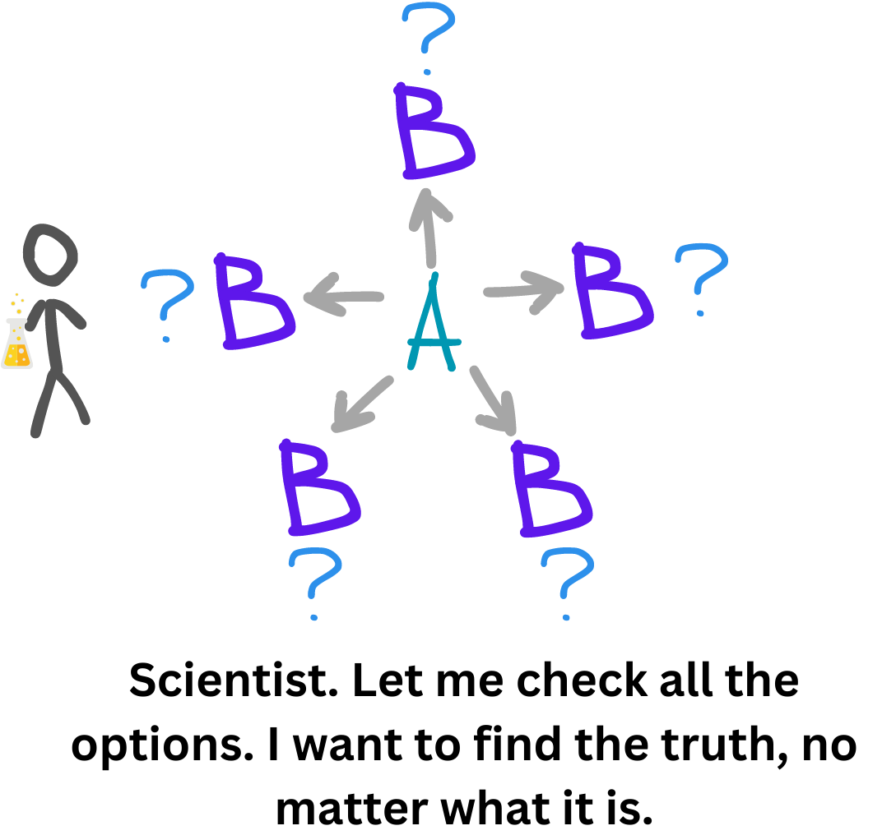
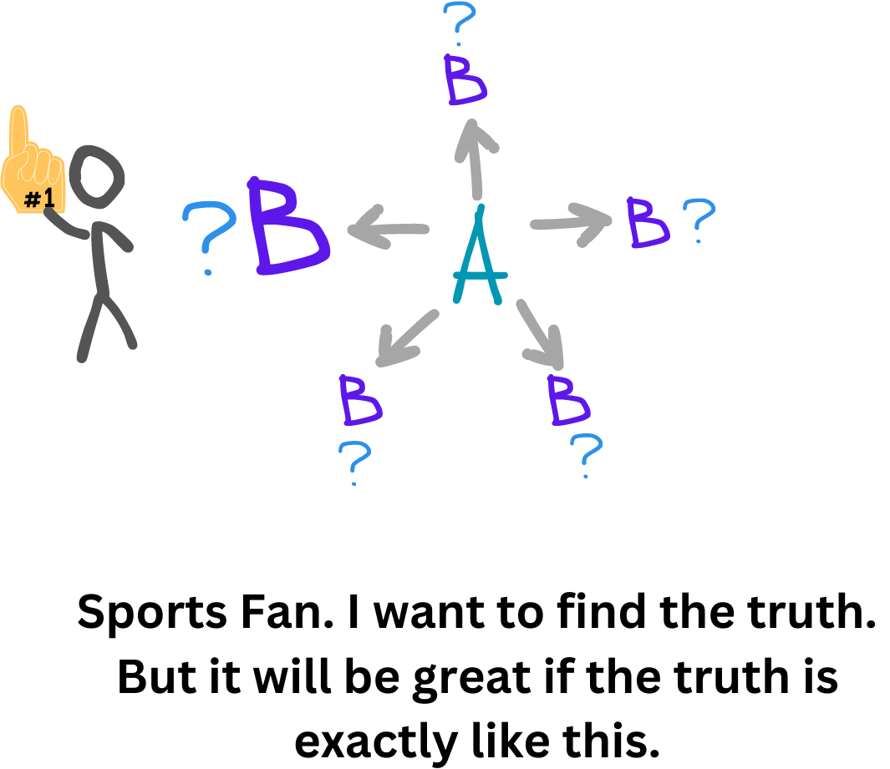
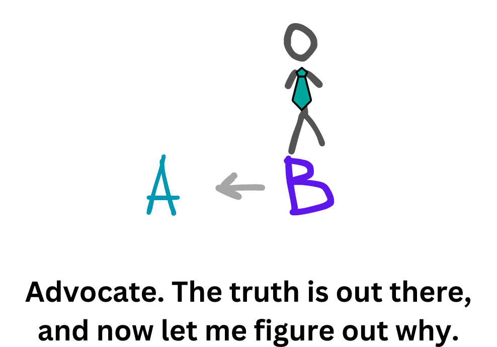
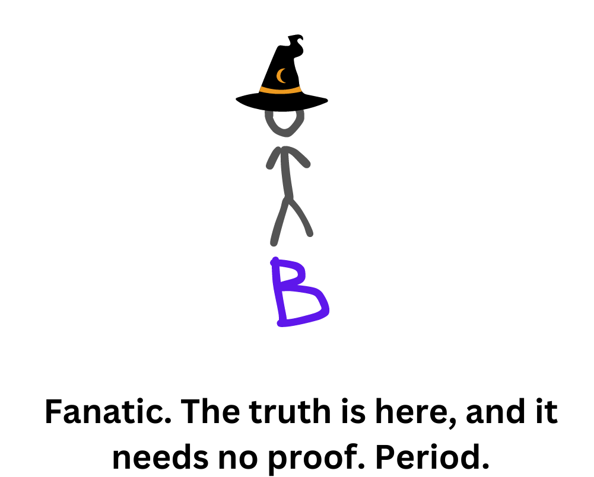

Зазвичай ти думаєш головою. Навіть у ті моменти, коли тебе запитують: "Про що ти думав перед тим, як це утнути?". Швидше за все, тоді ти теж думав головою, але є підозри, що не тією частиною. Наш мозок розвивався тисячоліттями, навчався новому, але старого не цурався. За тисячі років він став дуже розумним, та все ж звички первісних людей нікуди не зникли. Вони відходять на другий план, щоб втрутитися в ті моменти, коли виникає загроза життю або існуванню. Я буду називати цей відділ мозку Примітивним Розумом, а той, який людство набуло за останні тисячі років, — Вищим Розумом. Більшу частину часу ти керуєшся Вищим розумом. Він дозволяє тобі мислити логічно, структуровано і приймати зважені рішення. Але іноді проявляється і Первісний. Його дуже ефективно використовують маркетологи на касах супермаркетів, підсовуючи тобі під ніс всілякі солодощі, поки ти стоїш у черзі. Первісний розум ще пам'ятає, як можна було тижнями сидіти в печері без їжі, тому потрібно отримати максимальну кількість калорій про запас. Хто знає, можливо, тобі знову доведеться голодувати. Тому ти часто купуєш всілякі солодощі, з'їдаєш половину шоколадної плитки за раз замість 1 шматочка, а на сніданок обираєш круасан, а не яблуко. Для первісного розуму це цілком адекватна поведінка, мало того, це його завдання. Але період голодування ніколи не настає, бо їжа зараз супер доступна, а ти й далі продовжуєш їсти. Це лише один приклад, але суть ти зрозумів: він відповідає за збереження нас як раси й мислить печерними категоріями. У нього ще свіжі спогади про мамонтів, голодні тижні та холодні місяці. Основне завдання — виживання та розмноження. Коли він відчуває загрозу або можливість для цього, він намагається взяти верх. А як щодо Вищого Розуму? Він відповідає за мислення, рефлексію, структуру, логіку, раціональність. Саме розвиток неокортексу допоміг людям стати домінуючою расою на Землі. Його роль виходить далеко за межі базових людських потреб, і саме він ставить питання "Хто я і в чому сенс мого життя?".

Ймовірно, ти вже чув ці поняття раніше. Я просто нагадаю, оскільки буду посилатися на нього трохи далі. А тепер уяви собі чотири можливі ситуації співіснування цих двох сутностей та їх домінування в парі. У першому випадку Вищий повністю контролює Примітивний, у другому Вищий все ще домінує, але Примітивний вже дає про себе знати, у третьому Примітивний домінує, але Вищий ще втручається, і в четвертому — Примітивний повністю контролює ситуацію. Ці чотири випадки ми зараз і розглянемо.

### Думати як науковець

Науковцю байдуже, яким буде кінцевий результат експерименту, головне, щоб він був правдивим. Він не накладає очікувань, не фальсифікує результати, робить все максимально чесно і без упереджень і що отримує, з тим і погоджується. Сам процес дослідження складається з двох основних етапів: формування гіпотези та її перевірки. На етапі формування спочатку збирається інформація. Тут важливо знайти якомога більше різних джерел про об'єкт дослідження, не перебираючи та не відкидаючи жодної версії. Чим більше, тим краще. Суперечливі? Нехай буде так. Різні за сенсом? Запакуйте ще два. Далі йде процес перевірки. І якщо під час збору йшлося про кількість, то під час обробки — про якість. Кожне джерело перевіряється на правдивість, звіряються дані, робиться перехресна звірка. Тут велику роль відіграє так зване непряме знання. Ця проста концепція зробила велике відкриття в моїй голові. Уяви собі, більшість знань (я б сказав, 90%) ти знаєш тому, що хтось тобі про це сказав, і ти повірив. Це стосується не лише новин, реклами та передвиборчих обіцянок. У школі тобі сказали, що 2+2 = 4, ти повірив, а потім вже сам будеш розказувати про це своїм дітям. Те, що Земля є третьою за рахунком планетою в нашій системі від Сонця, бачила власними очима невелика група людей, але про це знає кожен на планеті. Якщо заглибитись в роздуми про цю концепцію, то ти віднайдеш себе в матриці, де все побудоване на умовних домовленостях між людьми, що всі будуть вірити в те ж саме. Що ось цей шматок паперу — це грошова купюра і ти за неї можеш отримати будь-які реальні речі, ось цей жовтий метал з не найвидатнішими фізичними характеристиками є дорогоцінним і коштує велику кількість купюр. І такими твердженнями наповнений ввесь наш простір, сам подумай. Саме ця концепція створила великий прогрес у розвитку людства з появою зручних способів передачі непрямих знань майбутнім поколінням. У цій системі є дуже важливий гвинтик: довіра до джерела. Коли друг розповідає тобі про дуже вигідну інвестицію в криптовалюту, ти повинен довіряти йому і його експертизі в цій сфері. Мало того, ти повинен довіряти його почуттю довіри до непрямих знань, які він отримав раніше в цій темі, а також достатньому рівню його критичного мислення. Враховуючи той факт, що кожна людина має власну призму знань і досвіду. Вся інформація проходить через цю призму і дещо спотворюється відносно джерела. Іноді ми додаємо власні судження, оцінки, змінюємо пріоритети, фокус, упускаємо деталі. Словом, це гра у зламаний телефон. Якщо щось не дочув чи не зрозумів, додумав сам та розказав другому. Тому головні інструменти науковця на цьому етапі — здоровий скептицизм і критичне мислення. Непрямі знання — це добре, але вірити всьому підряд небезпечно для чистоти експерименту. З цих пазлів інформації вчений формує гіпотези. Формує різні і багато. Він намагається поєднати навіть, здавалося б, несумісні речі. Потім настає етап перевірки. Адже гіпотеза може бути ідеальною лише на папері, а вченому потрібно довести, що вона ефективна на практиці. Тому він бере їх одну за одною, тестує, обмірковує, коригує, крутить її в різні боки, поки не знайде істинну версію. Вчений не прив'язаний до своїх гіпотез і не віддає перевагу жодній з них, тому може прийняти і відкинути будь-який варіант. Він також чітко розділяє гіпотезу та особистість. Якщо інший вчений скаже йому: "Твоя теорія нічого не варта, і ось чому!", він скаже щось на кшталт: "Гарне зауваження, я ніколи не дивився на це з такої точки зору" і сприйме це не як особисту образу, а як ще один шанс покращити свою гіпотезу і ще ближче наблизитися до істини. Саме тому вчений часто сумнівається у своїх ідеях і час від часу переглядає їх.

### Думати як спортивний фан

Спортивний фан ну дуууже хоче, щоб судді на полі, рефері в рингу або журі в залі були обʼєктивними та справедливими. Він сподівається на чисту гру за правилами та чесність результату. Разом з цим, він також дуже хоче, щоб саме його команда чи атлет за цих умов перемогли. Здатний применшувати провали своїх улюбленців, та вихвалятись бодай якимись успішними результатами, ніби це найголовніше досягнення всіх часів. Він все ще хоче віднайти правду, але було би супер круто, якби правда була от такою, якою він хоче її бачити. Через це він не завжди обʼєктивний і часто схиляється в якусь одну сторону. Фан все ще як і науковець збирає інформацію, але деяку, яка не підходить, може свідомо або не свідомо пропускати. Він все ще робить аналіз та формує гіпотези, але робить це через свій фільтр. На етапі тестування він привʼязаний до своїх гіпотез і очікує результат саме від них. Він дуже схожий на науковця і хоче знайти правду, але трохи корумпований своїми ідеями. Саме тому фан трохи більше впевнений в своїх ідеях, ніж науковець і сміливо про них заявляє.

### Думати як адвокат

Адвокат дуже схожий на спортивного фана у своїй прив'язаності до ідеї. Але якщо на фана тиснути фактами і доказами, він все одно прийме правду, якою б гіркою вона для нього не була. Адвокат же буде відстоювати свою позицію до кінця. Він не йде від пункту А в пункт Б. Він починає з пункту Б, а потім шукає докази того, як він туди потрапив. У мене є твердження Б, і я вам його зараз доведу. Інакше хіба був би справжній адвокат хорошим професіоналом у своїй справі, якби він робив не так? Він збирає тільки ту інформацію, яка необхідна для підтвердження, а решту безжально відкидає або ігнорує. Він перевіряє гіпотези лише за сприятливих для нього умов. Якщо таких умов немає - до біса тести, повірте мені на слово, бо я вважаю, що це правда. Сперечатися з адвокатом - все одно, що сперечатися зі стіною. Ти не зміниш його думки, але легко можеш стати його особистим ворогом, тому що його ідеї дуже сильно прив'язані до його особистості. Якщо адвокат вірить в НЛО, він наведе тобі сотні прикладів їх існування, щоб довести це, і без належної частки скептицизму і критичного мислення ти можеш повірити в це сам, оскільки його впевненість у своїй правоті буде беззаперечною. Саме тому адвокати часто застряють у своїх переконаннях, не розвиваються і не вчаться нічому новому.

### Думати як фанатик

Фанатик не йде з точки А в точку Б. Він як і адвокат уже в точці Б. Але при цьому в нього нема потреби будь-що доводити. Він на 100% впевнений у своїй правоті і якщо хтось з ним погоджується, він сприймає це як очевидний факт, якщо ж хтось перечить — то ця людина нічого не тямить і справ з нею мати не треба. Його ідеї дуже крихкі та не надійні, він настільки до них привʼязаний, що сам є цією ідеєю. Тому будь-яка змістовна або беззмістовна критика — це удари особисто по ньому і сприймаються вони відповідно. Тут нема ніякого збору інформації або перевірки теорій, тут є факт. Він такий. Крапка. Світ науковця доволі складний. В ньому повно сумнівів, перевірок, відкритих питань. Життя туманне і не розмите. Життя ж фанатика ясне, просте і зрозуміле. Але чорно-біле. Є моя правда і є решта. Наскільки вірні його твердження, фанатика не цікавлять. Він впевнений в них на всі 100%.

Перші два способи мислення — це продуктивні способи. За допомогою них ти розвиваєшся, дізнаєшся щось нове, відкритий до знань. Саме через них ти отримуєш знання та мудрість. Два останніх — це однобокі. Ти привʼязаний до своїх ідей, заангажований результатом на майже ніколи не змінюєш свою думку, що призводить до втрати пластичності твого розуму і створенню хибних переконань. Тому намагайся більше часу проводити в перших двох ролях.

Ну і на останок. Ти ж памʼятаєш про поняття непрямих знань? От це якраз приклад таких. Це ідеї не мої, я просто їх прочитав у книжці “What’s our problem?” за авторством Tim Urban і переказав їх тобі, звичайно ж, пропустивши через свою призму. Тому тобі треба сприймати цей текст з долею скептицизму та критичного мислення. Автору цієї книги я би довіряв, він писав її 6 довгих років і дуже глибоко копнув цю тему. Але може саме зараз в мені говорить спортивний фан, оскільки ідеї автора мені подобається і я хочу, щоб вони були вірними. В мене після цієї статті виникло бажання більше займатись “науковою роботою”. Ставити якусь задачу або ціль і розібратись з нею, як науковець, створити власні висновки та отримати живий результат, а не просто переповісти щось, що дізнався вчора сам.
